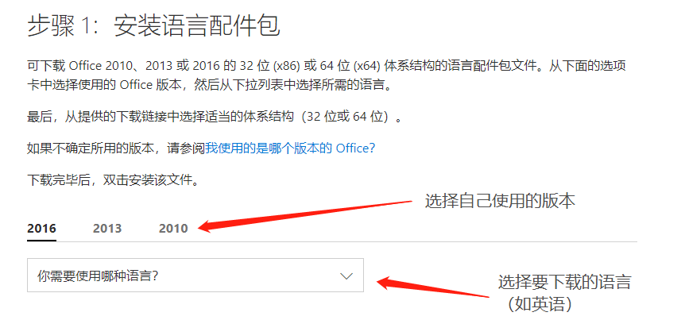

## 为 Office 修改显示语言的方法

> 作者：Zhenghao Wu
>
> 2018年3月11日
>
> 因为学校为机房（T29-201/T29-202）安装的是 Office 2010 版本，而且现在大多电脑出厂预装的是 Office 2016 版本，所以本教程中的方法只适用于 Office 2010 及以后版本（2010, 2013, 2016）。

### 步骤一 · 下载相应语言包

访问微软 Office 支持网站中关于“[Office 语言配件包](https://support.office.com/zh-cn/article/office-%E8%AF%AD%E8%A8%80%E9%85%8D%E4%BB%B6%E5%8C%85-82ee1236-0f9a-45ee-9c72-05b026ee809f?ui=zh-CN&rs=zh-CN&ad=CN)”的页面，根据自己正在使用的 Office 版本和需要的语言选择并下载语言配件包。

### 步骤二 · 安装语言包

下载语言包到本地后，双击文件进行安装，安装过程一般不需要进行干预，等待安装完成即可。

### 步骤三 · 配置 Office 语言

1. 打开任意 Office 程序，然后单击 “**文件**”>“**选项**”>“**语言**”。
2. 在 “**选择编辑语言**” 下，确保将要使用的语言添加到此列表中。
3. 在 “**选择用户界面和帮助语言**” 下，可以更改所有 Office 应用程序的默认界面和帮助语言。
   - 只需将你需要设置的目标语言选中，并点击”**设为默认值**“即可。
4. 重启 Office 程序以使更改生效。

---

至此，你的 Office 的显示语言就已经更改。

### Reference

1. [Office 语言配件包 - Office 支持](https://support.office.com/zh-cn/article/office-%E8%AF%AD%E8%A8%80%E9%85%8D%E4%BB%B6%E5%8C%85-82ee1236-0f9a-45ee-9c72-05b026ee809f?ui=zh-CN&rs=zh-CN&ad=CN#ID0EAACAAA=2016)

### 接下来

[返回上一层](../../) | [下载PDF](office-language-pack-install.pdf)