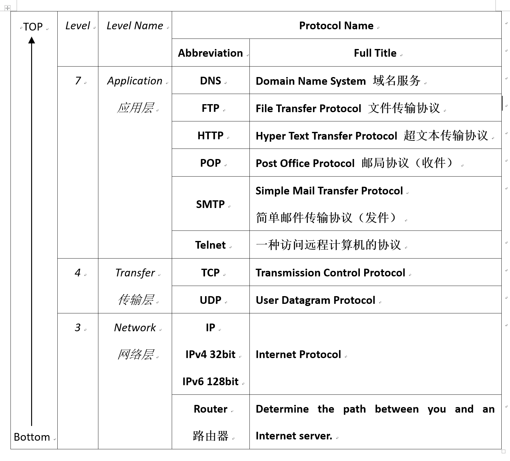

> 编写：钟钧儒
>
> 最后修改日期：2018年5月3日

## Summary - The Internet

This is a summary on important concepts showed in the lecture notes, and categorized by the author.

### Networks

Network: A **collection** of computers and devices **connected** to **share** information and resources.

Networks by range:

* LAN: **Local Area Network**
* WAN: **Wide Area Network**
* The Internet: A **network** of computer **networks** worldwide. (two "network")
  * **Information Highway**, **the net**, **cyberspace**

### The Internet

* History of the Internet
  * 1957: The first artificial satellite by USSR
  * 1958: US Department of Defense: the **Advance Research Project Agency**
  * **1969: APRANET**
  * 1984: APRANET connected 1000+ computers
  * 1992: the **World Wide Web (WWW)** *protocol* released.
* Nobody owns the Internet, non-profit group *Internet Society*.

### Connectivity

* Connection mechanisms: 
  * Wired connection:
    * Phone *modem* (调制解调器，猫), up to 64Kbps
    * **Broadband connection**, up to 2-4Mbps
      * *DSL / ADSL:* (Asymmetric) Digital Subscriber Line, (非对称)数位用户线路, Download > Upload
      * Cable *modem* (有线电视调制解调器)
    * LAN, with switches (交换机) and routers (路由器)
  * Wireless connection:
    * Hotspots (热点)
    * Wireless adapters (无线网卡): Use by computers
    * Wireless routers (无线路由器): Send signal
* **Internet Services Provider**

### Who & Where (Addressing)

One major problem in Internet is to find **who you are** and **where you are**. In order to solve this problem, the **Internet Protocol (IP)** was introduced.

* **IP Address** (IMPORTANT)
  * 4*8 = 32bits length
  * Composed of **network address** and **host number**
  * **Network address** indicates the network this computer locates
  * **Host number** indicates the specific computer in that network

Another problem is that the IP address is hard to be memorized by human. People established a system call **Domain Name System (DNS)** to covert meaningful names to IP addresses.

* **Domain Name System (DNS)** (IMPORTANT)
  * A *hostname* consists of **domain name** and **computer name**
  * e.g. `uic.edu.hk` is a *domain name*, and `dst.uic.edu.hk` can be a *hostname* indicates a *computer* within the domain `uic.edu.hk`.
  * It is a *recursive* process. It can be said that, `uic.edu.hk` is a *hostname* in domain `edu.hk`, and `edu.hk` is a *hostname* in domain `.hk`.
* **Top-level domain**
  * The last section of a domain name is the **top-level domain** to identify the organization that this *hostname* belongs to.
  * A country-based (except US) organization has a two-letter country code.
* A Domain Name **Server** (DNS) is used to *translate* the domain name to *IP Address*.

### Client / Server Model

All machines work on the Internet follow the **Client / Server** model.

Client send *requests* and server send *responses*.

### Packets & Routers

* Messages are divided into **fixed-sized**, **numbered** **packets**.
* **Routers** are used to direct these **packets**, they determine the **path** between you and an Internet server.

### Protocols & Applications

Network protocols are always layered. The layered protocol is referred to as a **protocol stack**.

Here is a case of layered protocols. *Just for your references.*

* TCP: **Transmission Control Protocol**
  * Breaks messages into packets, then hands to IP software for delivery.
  * Orders and reassembles the packets to messages at destinations.
* IP: **Internet Protocol**
  * Deals with the *routing* of the packets.

### 接下来

[返回上一层](../../) | [下载PDF版](the-internet.pdf)